# WeatherHub Backend — Architecture Diagrams

Pure-tech architecture reference. Diagrams only.

---

## 1. System topology

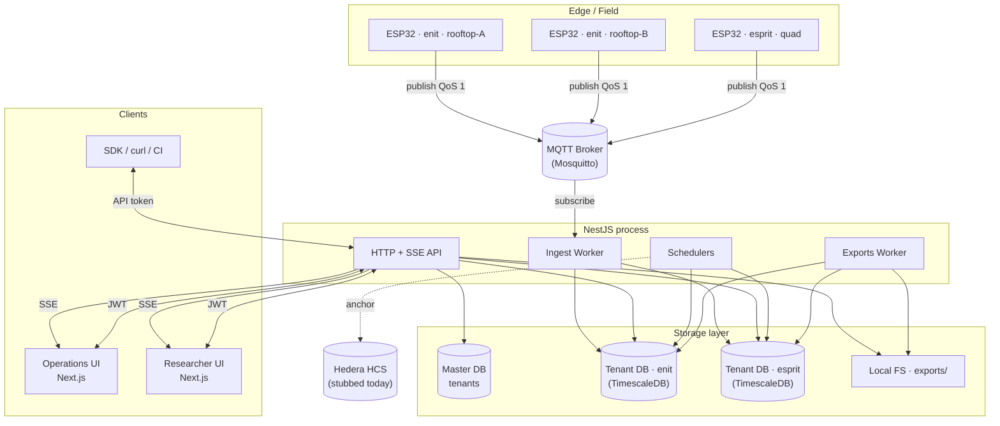

---

## 2. Multi-tenancy — database-per-tenant

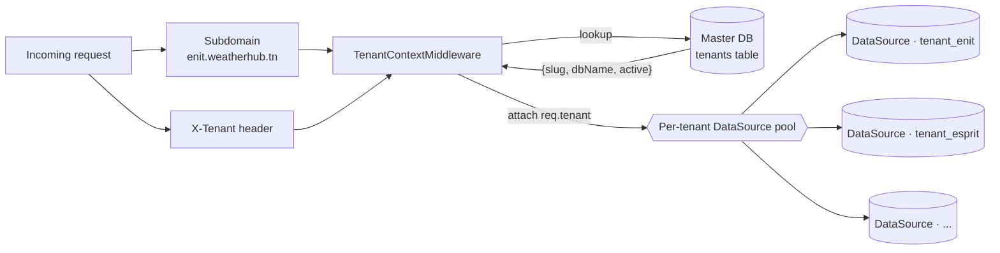

---

## 3. Per-tenant database schema

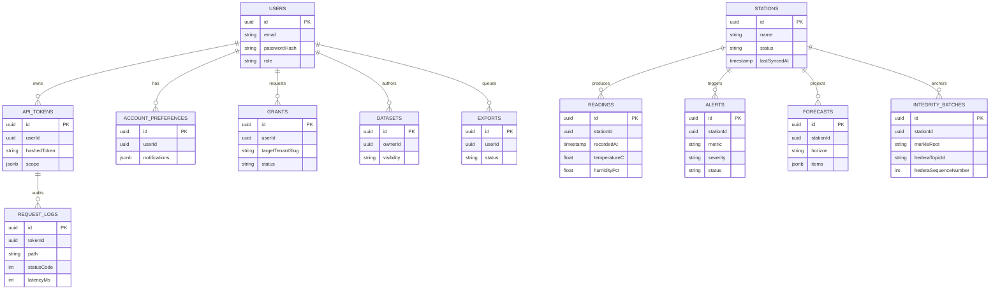

---

## 4. Live data path — ESP32 reading to browser

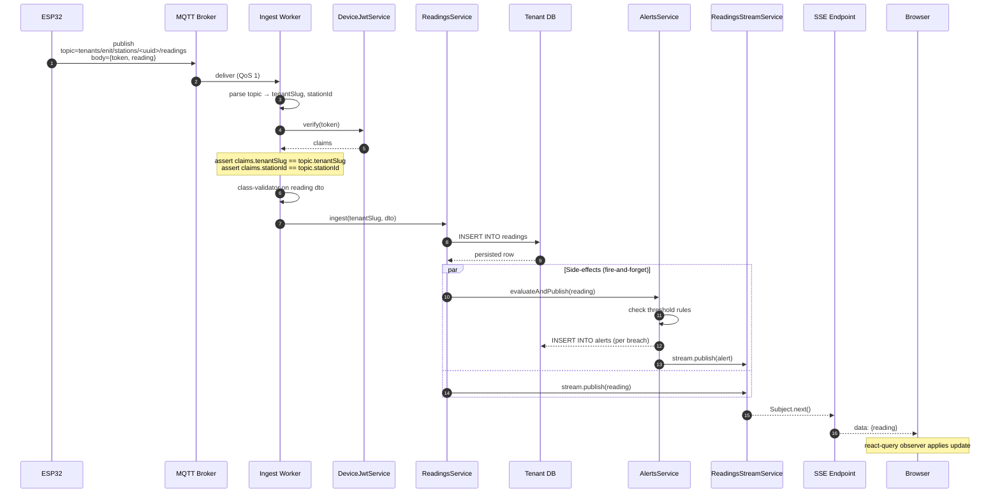

---

## 5. Ingest worker — message validation pipeline

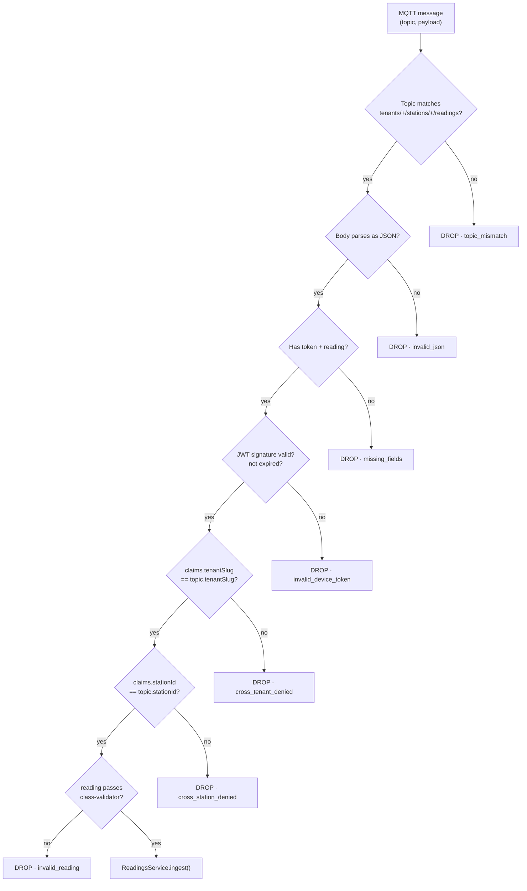

---

## 6. SSE fan-out

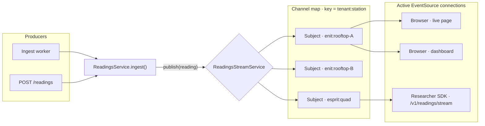

---

## 7. HTTP request lifecycle through NestJS

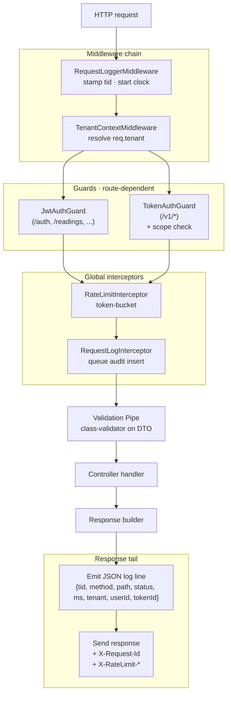

---

## 8. Auth flow A — Operator JWT session

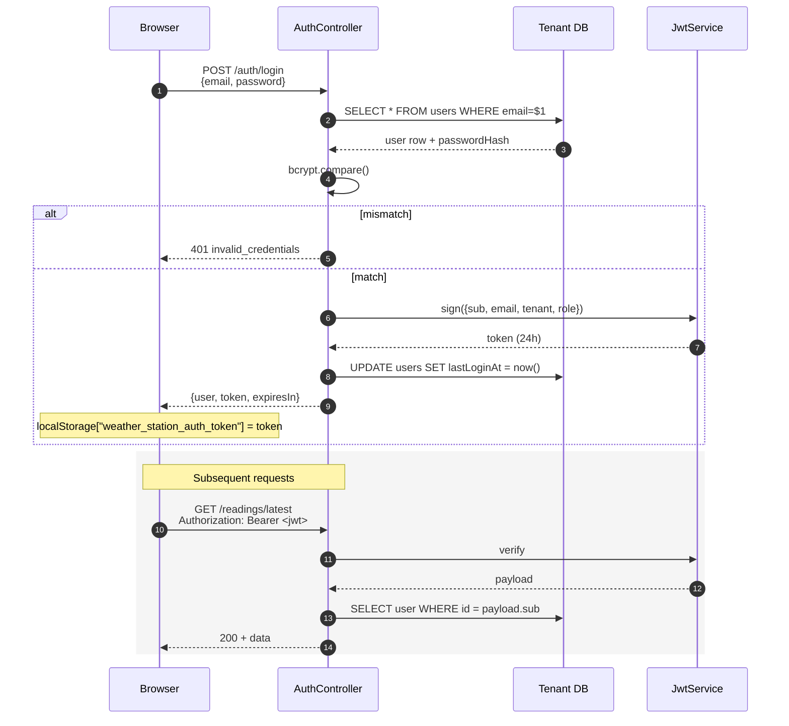

---

## 9. Auth flow B — API token (Researcher)

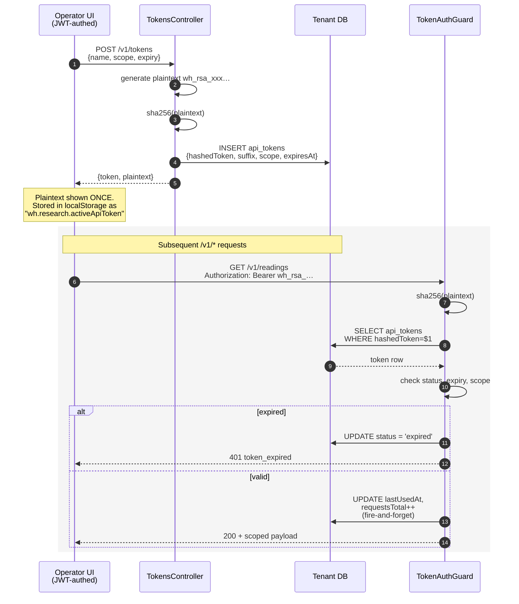

---

## 10. Auth flow C — Device JWT (MQTT only)

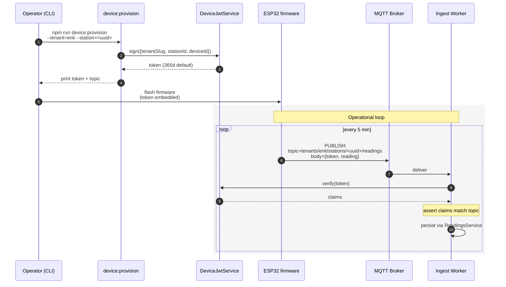

---

## 11. Background workers — schedulers + queues

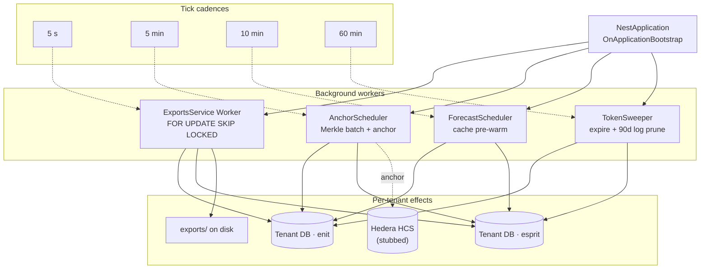

---

## 12. Anchor + integrity verification

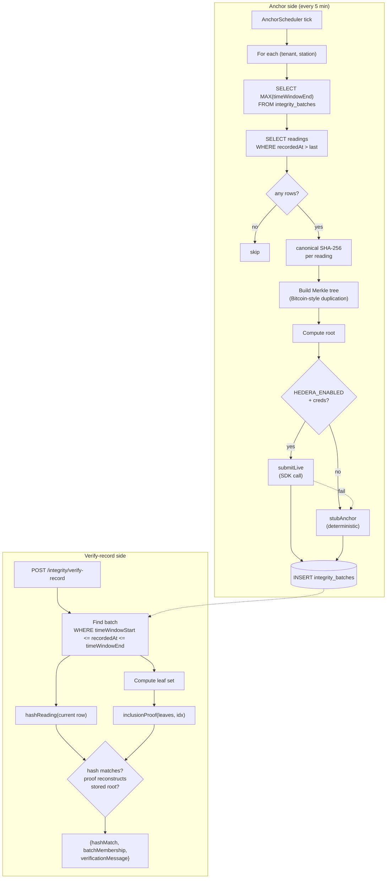

---

## 13. Forecast generation

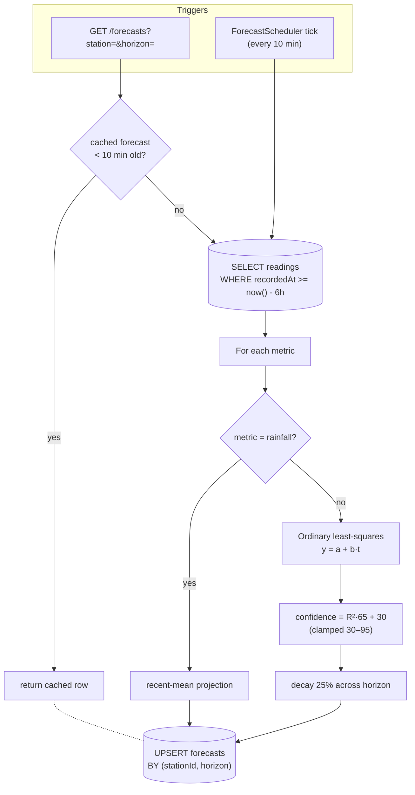

---

## 14. Export job state machine

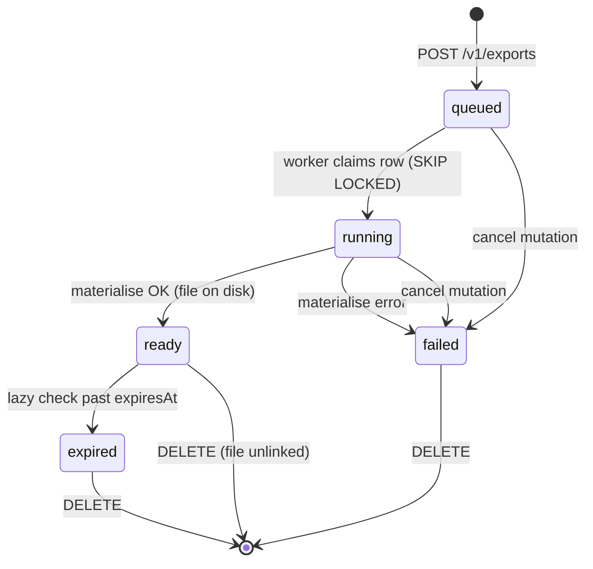

---

## 15. Export materialiser — streaming write

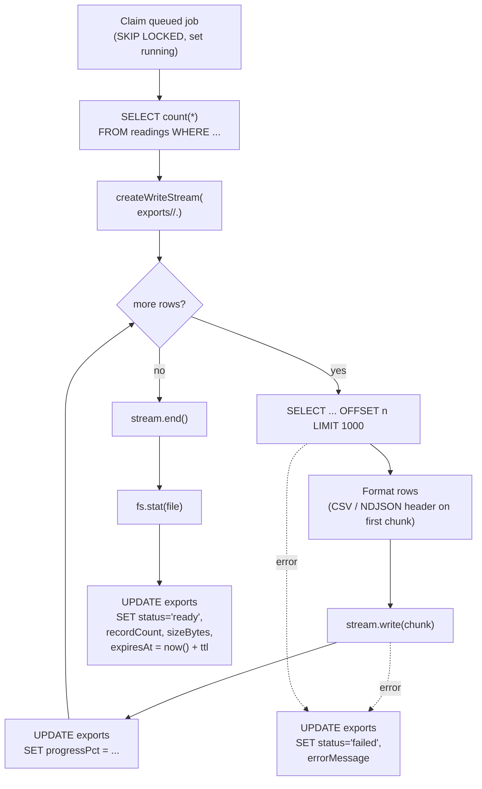

---

## 16. Rate-limit decision

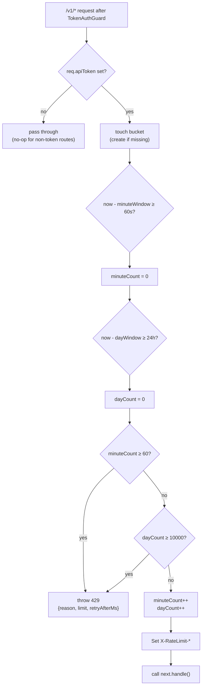

---

## 17. Observability — request → log line

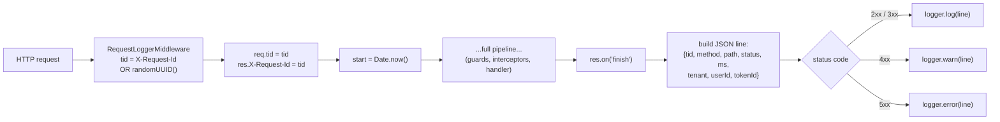

---

## 18. Module dependency graph

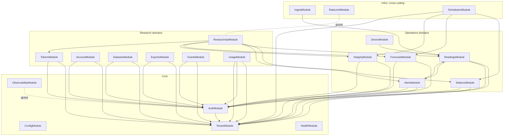

---

## 19. User journey — Operator daily routine

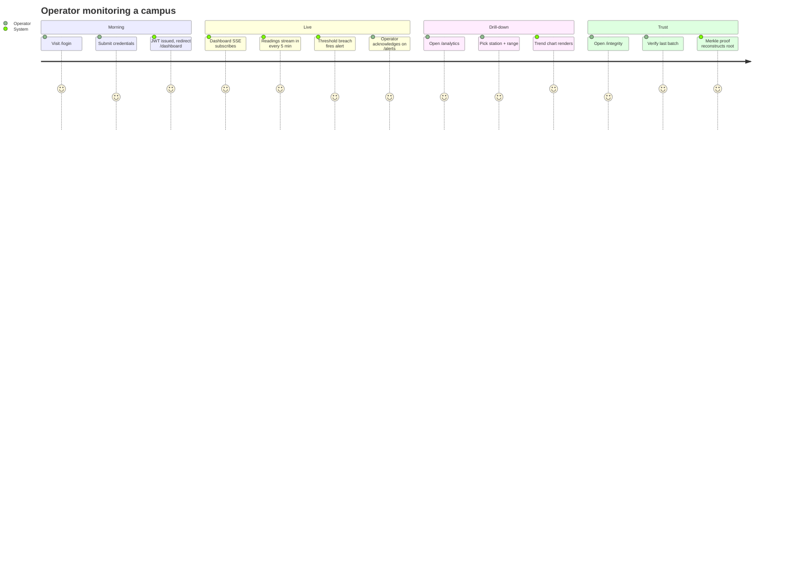

---

## 20. User journey — Researcher onboarding

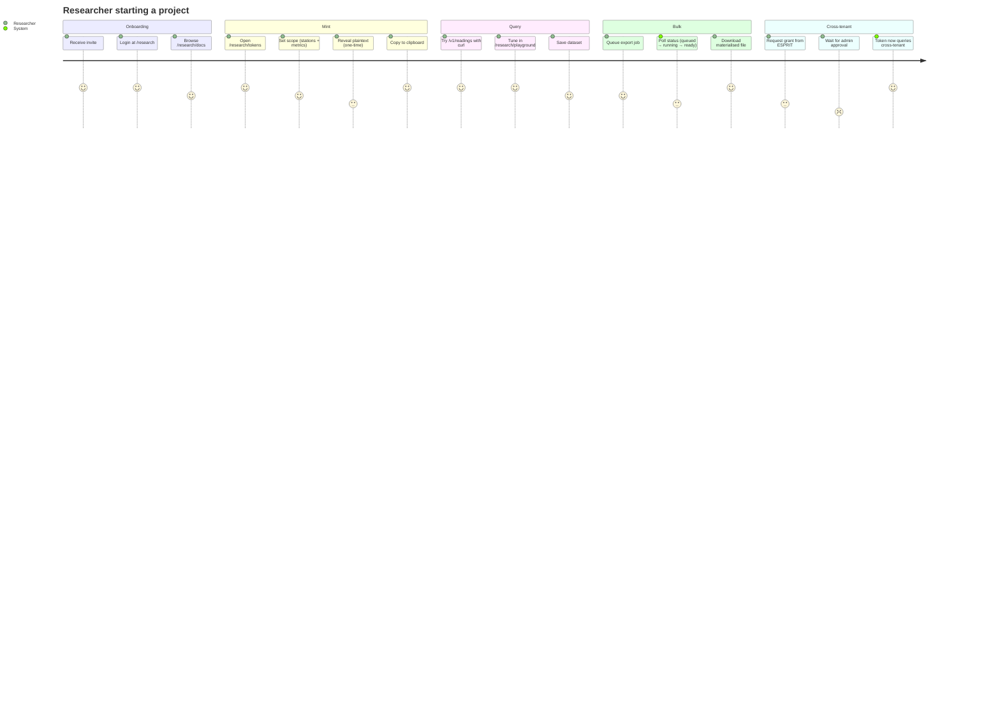

---

## 21. User journey — ESP32 device lifecycle

```mermaid
journey
    title ESP32 station lifecycle
    section Provisioning
      Operator runs device:provision: 5: Operator
      JWT signed (365d): 5: System
      Operator flashes firmware: 4: Operator
    section First boot
      Power on: 5: Device
      Connect to wifi: 4: Device
      Connect to MQTT broker: 4: Device
    section Steady state
      Read sensors: 5: Device
      Publish to tenant topic: 5: Device
      Ingest worker verifies + persists: 5: System
      SSE pushes to dashboard: 5: System
      Anchor scheduler batches + anchors: 5: System
    section Failure modes
      Wifi drop: 2: Device
      Local buffer (up to N readings): 3: Device
      Reconnect + flush: 4: Device
      Token rotation by ops: 3: Operator
```

---

## 22. Deployment topology (target)

```mermaid
flowchart TB
    subgraph Internet
        Devs["Researchers / SDKs"]
        Ops["Operators (campus)"]
        ESP["ESP32 fleet"]
    end

    subgraph Edge["Edge gateway"]
        LB["Reverse proxy / TLS<br/>(nginx / Caddy)"]
        MQTTPublic["Mosquitto<br/>(TLS, MQTT 1883/8883)"]
    end

    subgraph App["App tier (stateless)"]
        N1["Next.js node #1"]
        N2["Next.js node #2"]
        B1["NestJS node #1"]
        B2["NestJS node #2"]
    end

    subgraph Data["Data tier (stateful)"]
        PG[("PostgreSQL + TimescaleDB<br/>master + tenants")]
        Vol[("Block storage<br/>exports/ + backups/")]
        Mirror[("Hedera mirror node<br/>(read-only)")]
    end

    Devs --> LB
    Ops --> LB
    ESP --> MQTTPublic
    LB --> N1 & N2
    LB --> B1 & B2
    MQTTPublic --> B1 & B2
    N1 & N2 -- "SSR / API proxy" --> B1 & B2
    B1 & B2 --> PG
    B1 & B2 --> Vol
    B1 & B2 -. "anchor (Phase 5.5+)" .- Mirror
```

---

## 23. Configuration surface — `WH_MODE` decision tree

```mermaid
flowchart TB
    Boot["Process boot"]
    Read["readMode()<br/>= WH_MODE env"]
    Sw{"value"}
    Prod["production"]
    Demo["demo"]
    Test["test"]

    subgraph Behaviours
        ProdBeh["Real backend required<br/>refuse default JWT secrets<br/>no mock fallback in services<br/>MQTT worker enabled<br/>Schedulers enabled"]
        DemoBeh["Real backend preferred<br/>mock fallback on failure<br/>MQTT worker enabled<br/>Schedulers enabled"]
        TestBeh["No network<br/>mocks only<br/>MQTT worker disabled<br/>Schedulers disabled<br/>mockDataDelay = 0"]
    end

    Boot --> Read --> Sw
    Sw -- production --> Prod --> ProdBeh
    Sw -- demo --> Demo --> DemoBeh
    Sw -- test --> Test --> TestBeh
    Sw -- "unknown / empty" --> Demo
```

---

## 24. Live SSE channel — connection states (browser side)

```mermaid
stateDiagram-v2
    [*] --> opening: new EventSource(url)
    opening --> open: onopen
    opening --> error: TCP fail / 4xx
    open --> open: message
    open --> closed: server end
    open --> error: network drop
    error --> opening: EventSource auto-retry<br/>(default 3s)
    closed --> [*]
```

---

## 25. End-to-end timing budget — reading freshness

```mermaid
gantt
    title One reading · ESP32 to UI
    dateFormat  X
    axisFormat  %S s
    section Device
    Sensor read + JSON encode    :a1, 0, 50
    MQTT publish (QoS 1)         :a2, after a1, 80
    section Broker
    Broker enqueue + ACK         :b1, after a2, 20
    section Backend
    Subscribe deliver            :c1, after b1, 10
    JWT verify + claim check     :c2, after c1, 5
    DTO validate                 :c3, after c2, 5
    INSERT reading               :c4, after c3, 30
    Threshold evaluate           :c5, after c4, 8
    Subject.next() fan-out       :c6, after c4, 2
    section Browser
    EventSource onmessage        :d1, after c6, 15
    React-query observer + paint :d2, after d1, 40
```
