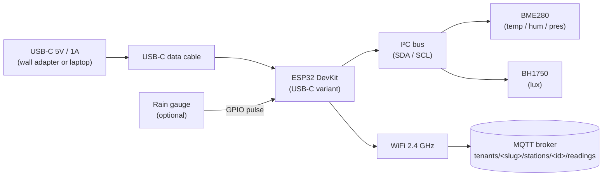
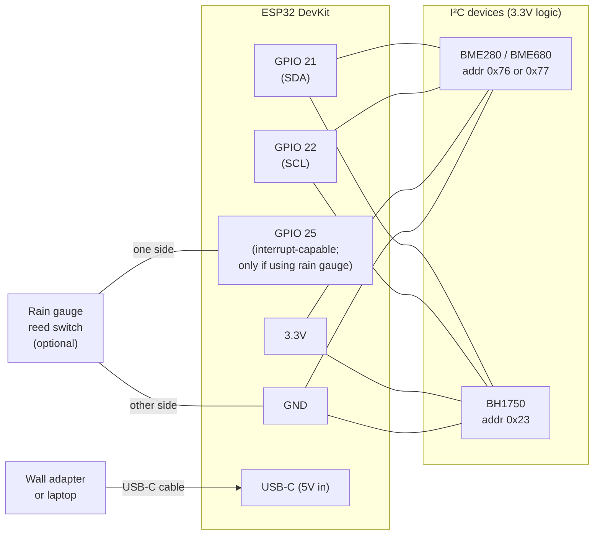
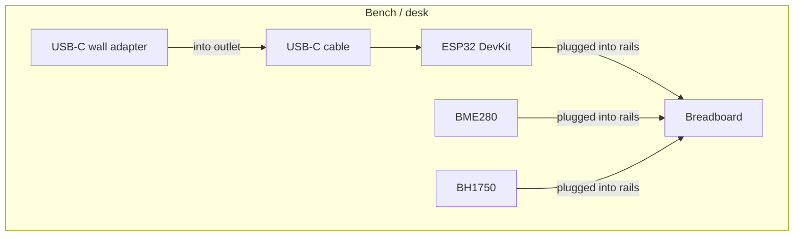
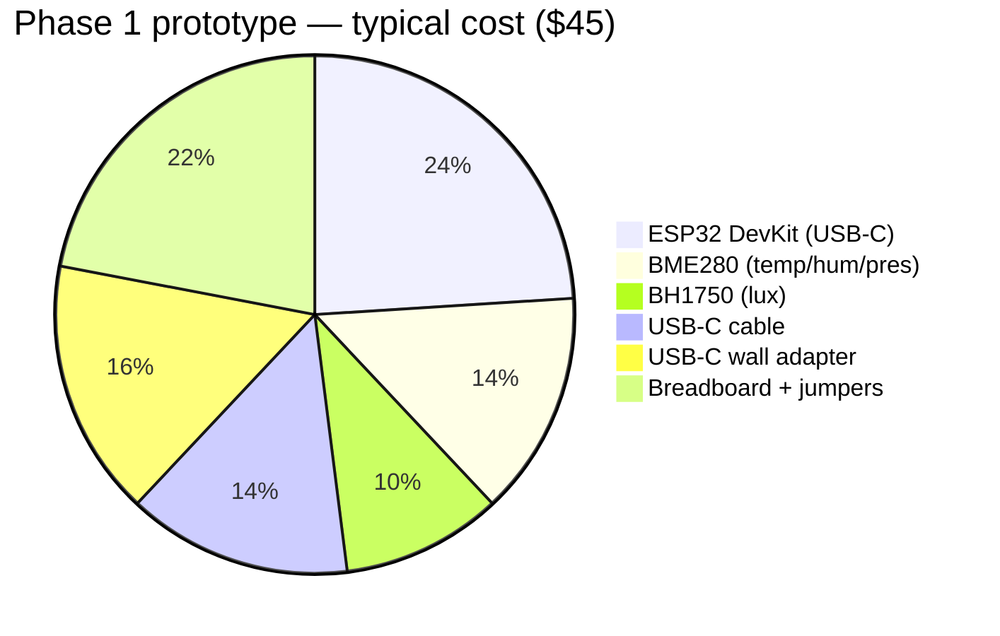

# WeatherHub — ESP32 station hardware

A concrete shopping list for an ESP32 weather station that publishes into the WeatherHub backend over MQTT.

**Phase 1 (this doc): tethered prototype.** The board runs from a USB-C cable, no battery, indoor or sheltered placement. Goal is fastest path to "readings landing in the dashboard." ~$35–$50 from Amazon.

**Phase 2 (notes at the end): outdoor / off-grid.** Adds solar panel, 18650 cell, charging board, waterproof enclosure, Stevenson screen. Adds ~$40 and a weekend of mechanical assembly.

The backend ingests these metrics from each station, so the sensor set is chosen to fill them:

| Metric              | Field on `WeatherReading`  | Sensor below                          |
|---------------------|----------------------------|---------------------------------------|
| Temperature (°C)    | `temperatureC`             | BME280 / BME680                       |
| Humidity (%)        | `humidityPct`              | BME280 / BME680                       |
| Pressure (hPa)      | `pressureHpa`              | BME280 / BME680                       |
| Light (lux)         | `lightLux`                 | BH1750                                |
| Air quality (AQI)   | `airQualityValue`          | BME680 (VOC) — Tier 2 swap            |
| Rainfall (mm)       | `rainfallMm`               | Tipping-bucket rain gauge (optional)  |
| Battery (V)         | `batteryVoltage`           | **null** in prototype (no battery)    |
| Signal (dBm)        | `signalRssi`               | ESP32 WiFi (no extra HW)              |

The backend already tolerates `null` for every metric — fields you don't wire just don't get reported.

---

## 1. System topology — Phase 1 (USB-C tethered)



Total parts on the critical path: **ESP32 board, 2 I²C sensor modules, USB-C cable, a handful of jumper wires.** That's it.

---

## 2. Bill of materials — Phase 1 prototype

Search terms are the ones that bring up the right part on Amazon US. Prices are typical 2026 ranges and will move with stock.

| # | Part                                  | Search term on Amazon                          | Qty | Est. $ each | Notes |
|---|---------------------------------------|------------------------------------------------|----:|------------:|-------|
| 1 | ESP32 DevKit **with USB-C**            | `ESP32-S3-DevKitC-1` or `HiLetgo ESP32 USB-C`  |   1 |  $10 – $15  | Many "NodeMCU ESP32" boards on Amazon now ship with USB-C — confirm in the listing photos. The S3 variant has native USB. |
| 2 | BME280 module (temp/hum/pres)          | `BME280 I2C 3.3V module`                       |   1 |   $5 – $8   | Confirm BME**280** with humidity, not BMP**280**. |
| 3 | BH1750 module (lux)                    | `BH1750 GY-302 light sensor`                   |   1 |   $4 – $6   | I²C, accurate to ~65k lux. |
| 4 | USB-C data cable (5V/3A capable)       | `USB-C charging cable data 3ft`                |   1 |   $5 – $8   | **Data, not charge-only** — needed to flash + power. |
| 5 | USB-C power supply (or use a laptop)   | `5V 2A USB-C wall charger`                     |   1 |   $5 – $10  | Skip if you'll power from a laptop / hub. |
| 6 | Dupont jumper wire kit (M-F, M-M)      | `Dupont jumper wires 40-pin`                   |   1 |   $5 – $8   | 4 wires per sensor (SDA, SCL, VCC, GND). |
| 7 | Solderless breadboard (400-tie)        | `400 point solderless breadboard`              |   1 |   $4 – $7   | Optional but makes wiring far cleaner than dangling Dupont. |
|   | **Subtotal**                           |                                                |     |  **~ $45**  |       |

### Optional add-ons (still Phase 1)

| Part                          | Search term                                  | Est. $ | Why |
|-------------------------------|----------------------------------------------|-------:|-----|
| Tipping-bucket rain gauge     | `Misol rain gauge` or `Sparkfun rain gauge`  | $15 – $25 | Adds `rainfallMm`. Only useful outdoors. Skip for indoor prototype. |
| BME680 (instead of BME280)    | `BME680 I2C breakout`                        | $15 – $25 | Adds `airQualityValue` (VOC index). Same wiring as BME280. |
| microSD card module + 32GB    | `microSD card module SPI`                    | $8     | Local buffering when WiFi drops. Nice-to-have, not needed for prototype. |

---

## 3. Wiring — GPIO pin assignment



**Pin reference table:**

| ESP32 pin | Goes to                              | Notes                                                  |
|-----------|--------------------------------------|--------------------------------------------------------|
| GPIO 21   | I²C SDA on both BME280 + BH1750      | Default I²C bus on most ESP32 boards                   |
| GPIO 22   | I²C SCL on both                       | Default I²C bus on most ESP32 boards                   |
| 3.3V      | VCC on both I²C modules               | **Do NOT use 5V on bare BME280** — it'll fry           |
| GND       | GND on every module                   | Common reference                                       |
| GPIO 25   | One side of rain-gauge reed (optional)| Interrupt-capable; skip if no rain gauge               |
| USB-C     | Wall adapter or laptop                | Provides 5V + serial for flashing                      |

I²C addresses don't collide:
- BME280: `0x76` (default) or `0x77` (SDO pulled high)
- BH1750: `0x23` (default) or `0x5C` (ADDR pulled high)
- BME680: `0x76` or `0x77` (same as BME280; swap parts, no rewire)

---

## 4. Physical assembly — Phase 1

Indoor / sheltered placement. No enclosure needed; the breadboard sits on a desk or shelf next to the wall outlet.



**Placement tips for honest readings**

- Keep the BME280 **away from the ESP32 body** — the regulator on the dev board self-heats and skews temperature by 1–3°C if mounted right next to it. A 10–15cm jumper wire is enough separation.
- Don't put the sensors on top of a laptop / radiator / sunlit windowsill. Even shaded indoor placement reads ~1°C higher than ambient.
- The BH1750 needs **direct line of sight to the light source** — pointing it at a wall is going to show 0 lux even in a bright room.

---

## 5. Firmware checklist

Once the hardware is wired, the firmware needs to:

1. Connect to WiFi.
2. Read I²C sensors (BME280, BH1750).
3. Build the JSON payload:
   ```
   { "token": "<DEVICE_JWT>",
     "reading": {
       "recordedAt": "<ISO timestamp>",
       "temperatureC": ..., "humidityPct": ..., "pressureHpa": ...,
       "lightLux": ...,
       "signalRssi": <wifi.RSSI()>
     } }
   ```
   Fields you don't measure (`rainfallMm`, `airQualityValue`, `batteryVoltage`) are omitted — the backend treats absent fields as null.
4. Publish to `tenants/<tenant-slug>/stations/<station-uuid>/readings` at QoS 1.
5. Sleep for the publish interval (5 min is the default the dashboard expects).
   - **Tethered mode** can use `delay()` / `vTaskDelay()` — no need for deep sleep since power is unlimited.

Get the device JWT (and the exact topic) from:

```sh
docker compose exec backend node dist/database/scripts/device-provision.js \
  --tenant=<slug> --station=<uuid>
```

---

## 6. Cost roll-up



Add **~$20** for BME680 (air quality + VOC), or **~$25** for a rain gauge (only if outdoors).

---

## 7. Pre-purchase sanity checklist

- [ ] ESP32 board has a **USB-C** connector, not micro-USB
- [ ] BME**280** (with humidity), not BME**P**280 — the spelling matters
- [ ] USB-C cable is rated for **data**, not charge-only — many bundled cables won't enumerate the COM port for flashing
- [ ] You have a USB-C wall adapter, OR you'll be powering the board off a laptop/hub during the prototype
- [ ] Sensor modules say **3.3V** in the listing — some breakouts are 5V-only and will fry

---

## 8. Phase 2 preview — outdoor / battery / solar (not yet)

When you're ready to put a station outdoors:

| Add                                          | Est. $    | Why |
|----------------------------------------------|----------:|-----|
| 6V / 2W solar panel (ETFE)                   | $8 – $15  | Charges the battery; sized for Tunis-latitude winter sun. |
| TP4056 charging module with protection chip  | $1 – $3   | DW01 IC visible on board. Without protection, the cell over-discharges. |
| 18650 Li-ion cell (Samsung 25R / Panasonic NCR18650B) | $5 – $10 | 3000+ mAh real capacity. Avoid no-name "9999 mAh" listings. |
| 18650 battery holder (solder tab)            | $1 – $3   |     |
| Schottky diode 1N5819 / SS14                 | $0.50     | Between solar `+` and TP4056 `IN+` so the cell can't drain back through the panel at night. |
| Voltage divider (2× 100kΩ resistors)         | $0.10     | Battery monitoring via ADC1 (GPIO 32). Reports `batteryVoltage` to the backend. |
| IP65/66 weatherproof enclosure (~200×150×100)| $10 – $18 | Polycarbonate; clear lid if you want to read the LEDs through it. |
| Cable glands (PG7 / PG9)                     | $0.50     | Waterproof cable entry — pointed downward always. |
| Stevenson screen (radiation shield)          | $0 – $40  | DIY from stacked PVC drain couplings (~$8) or pre-made ($30–40). Skipping this puts your temperature reading +5°C in noon sun. |
| Tipping-bucket rain gauge                    | $15 – $25 | Reed-switch contact closure per ~0.28 mm of rain. |

Plus the firmware-side changes — deep sleep between publishes, ADC sampling for battery, ULP counter for rain pulses — which the Phase 1 firmware doesn't need.

A Phase 2 station lands around **$120 all-in** and runs for years off the solar panel without intervention. Phase 1 covers the same data plane on the bench so you can ship the software first, harden the hardware later.
